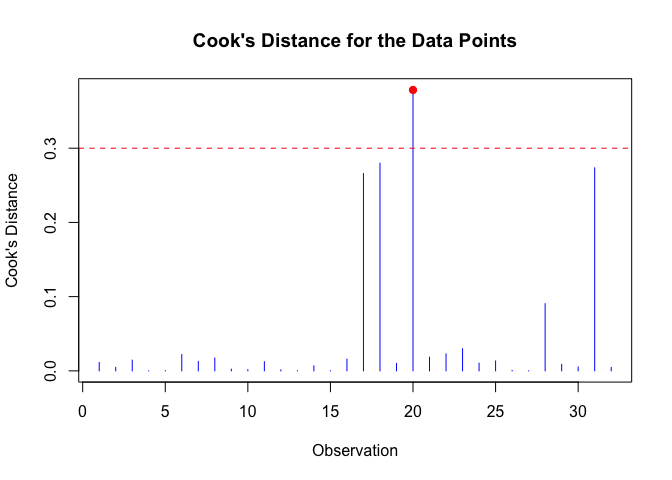

<!-- README.md is generated from README.Rmd. Please edit that file -->

# InfluentialPoints

<!-- badges: start -->
<!-- badges: end -->

The goal of InfluentialPoints is to assist users in pinpointing data
points that substantially impact the model’s parameters by calculating
various influence metrics, including Cook’s Distance, DFFITS, and Hadi’s
Influence Measure. It also provides visualization features, allowing
users to easily spot influential points through visually engaging
lollipop charts.

## Installation

You can install the development version of InfluentialPoints like so:

``` r
# install.packages("devtools")
library(devtools)
#> Loading required package: usethis
devtools::install_github("renswickd/R-Package-for-Influential-Points")
#> Using GitHub PAT from the git credential store.
#> Downloading GitHub repo renswickd/R-Package-for-Influential-Points@HEAD
#> ── R CMD build ─────────────────────────────────────────────────────────────────
#> * checking for file ‘/private/var/folders/z6/47hkfr6s6d1_cchpbbsz96k40000gn/T/RtmpMsbL68/remotes5b97406e7b47/renswickd-R-Package-for-Influential-Points-3385594/DESCRIPTION’ ... OK
#> * preparing ‘InfluentialPoints’:
#> * checking DESCRIPTION meta-information ... OK
#> * checking for LF line-endings in source and make files and shell scripts
#> * checking for empty or unneeded directories
#> Omitted ‘LazyData’ from DESCRIPTION
#> * building ‘InfluentialPoints_0.1.0.tar.gz’
#> Installing package into '/private/var/folders/z6/47hkfr6s6d1_cchpbbsz96k40000gn/T/Rtmp1NSvsO/temp_libpath5a413e5e6484'
#> (as 'lib' is unspecified)
```

## Example

This is a basic example which shows you how to solve a common problem:

``` r
library(InfluentialPoints)
```

``` r
# build a lm model
model <- lm(mpg ~ wt + hp, data = mtcars)
```

``` r
# use the function to calculate influential values and find influential points
output1 <- influential(model, type = "cooks", threshold = 0.3)
```



``` r
# influence scores of each record in the dataset
output1$Influence_Values
#>           Mazda RX4       Mazda RX4 Wag          Datsun 710      Hornet 4 Drive 
#>        1.127669e-02        4.676564e-03        1.441076e-02        4.734693e-05 
#>   Hornet Sportabout             Valiant          Duster 360           Merc 240D 
#>        2.749872e-04        2.192179e-02        1.265803e-02        1.732029e-02 
#>            Merc 230            Merc 280           Merc 280C          Merc 450SE 
#>        2.251506e-03        1.551363e-03        1.230696e-02        1.352704e-03 
#>          Merc 450SL         Merc 450SLC  Cadillac Fleetwood Lincoln Continental 
#>        1.444533e-04        6.763063e-03        2.673338e-05        1.572994e-02 
#>   Chrysler Imperial            Fiat 128         Honda Civic      Toyota Corolla 
#>        2.658722e-01        2.798053e-01        9.970975e-03        3.784888e-01 
#>       Toyota Corona    Dodge Challenger         AMC Javelin          Camaro Z28 
#>        1.835467e-02        2.286975e-02        2.975391e-02        1.023759e-02 
#>    Pontiac Firebird           Fiat X1-9       Porsche 914-2        Lotus Europa 
#>        1.330074e-02        5.413973e-04        5.380966e-06        9.051039e-02 
#>      Ford Pantera L        Ferrari Dino       Maserati Bora          Volvo 142E 
#>        8.818118e-03        5.197866e-03        2.735700e-01        4.660207e-03
```

``` r
# influential data points in the dataset 
output1$Influential_Points
#> named integer(0)
```
